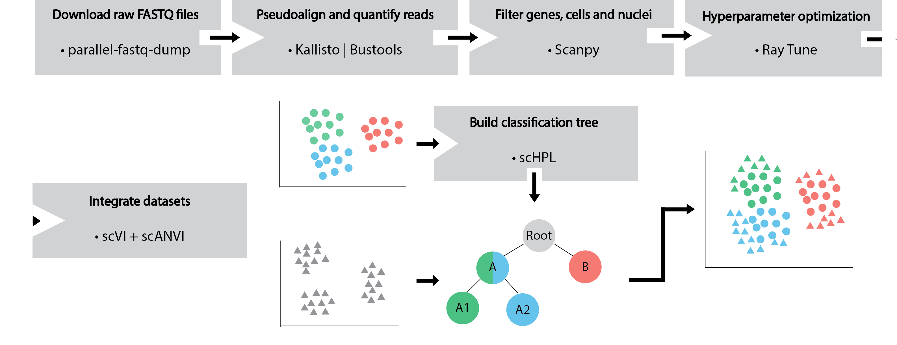

# Mouse Kidney Atlas



We present the Mouse Kidney Atlas (MKA), a comprehensive atlas of cellular heterogeneity in the healthy mouse kidney, which we generated by carefully integrating data from eight publicly available studies. We integrate these datasets using [scVI and scANVI](https://scvi-tools.org/). To overcome annotation inconsistencies we learn the relationship between cell type transcriptomic profiles across datasets using [scHPL](https://github.com/lcmmichielsen/scHPL). This model is then able to automatically label unseen cell populations with unprecedented resolution and accuracy. We demonstrate the significance of our atlas by obtaining robust and novel markers for poorly described cell types.

The MKA is publicly available to download, visualize and interact with at [cellxgene](https://cellxgene.cziscience.com/collections/92fde064-2fb4-41f8-b85c-c6904000b859)

For more details refer to: [ A comprehensive mouse kidney atlas enables rare cell population characterization and robust marker discovery](https://www.biorxiv.org/content/10.1101/2022.07.02.498501v1)

## File descriptions
- **models**: Files containing the trained models used in the manuscript
- **notebooks**: notebooks used to generate the figures presented in the manuscript
     - <u>QC_scVI_scANVI </u>: Figure 1
     - <u>scHPL_ManualReannotation </u>: Figure 2 and 3

        Supplementary Figures 1, 2 and 3
     - <u>scHPL_Evaluation </u>: Figure 4

        Supplementary Figure 4 and 5
     - <u>Downstream_analyses </u>: Figure 5

        Supplementary Figure 6
- **MKA_Metamarkers.xlsx** Excel file with the identified metamarkers for each cell type label in the MKA.
    - **Rank**: Overall ranking for this gene within a cell type. The higher the ranking the better the marker is for the given population accounting for batch differences and number of datasets in which the gene is detected. 
    - **AUROC**: Area under the receiver-operator curve. This value is an indication of how good the gene is in a classification scenario. For example, Podxl has an AUROC value of 0.9, which means that this gene is very good at classifying Podocytes as such.

- **functions.py** helper functions used across the code
- **hyper_tune.py** [Ray tune](https://docs.ray.io/en/latest/tune/index.html) implementation to optimize scVI model hyperparameters

# Using the trained models

If you want to use the models for your own research you will need the HVG-filtered matrix we trained these on. You can find the AnnData object at [Zenodo](https://zenodo.org/records/10159136). Once downloaded, you can:


``` python
import os
import scvi
import scanpy as sc

os.chdir("MKA")
adata = sc.read_h5ad("adata.h5ad")
atlas_model = scvi.model.SCANVI.load("models/scANVI_model_full", adata=adata)
```
# Hyperparameter Optimization

[Ray tune](https://docs.ray.io/en/latest/tune/index.html) was used train 1000 different hyperparameter and model configurations. 

The tracked metrics at each training epoch were ``'elbo_validation'``, '``reconstruction_loss'`` and ``'silhouette_score'``. Batch and cell type silhouette scores computed on the latent space were used as objective functions to maximize during training. 

The search space was defined as follows:

- model configuration
    - dropout rate: loguniform distribution between `1e-4` and `1e-1`
    - number of layers: random integer between `1` and `3`
    - number of latent dimensions: random integer between `20` and `31`
- plan configuration
    - learning rate: loguniform distribution between `1e-4` and `1e-1`
- atlas architecture
    - subset: random boolean (`True`/ `False`). 
    > The purpose of this parameter is to test the effect of filtering the feature space
    - number of hvgs: random choice between ``2000`` and ``8000`` in ``1000`` increments
    - continious_covariates: random choice between ``'pct_counts_mt'`` and ``None``
    - categorical_covariates: random choice between ``'Source'`` and ``None``
    > 'Source' in this case refers to either nuclei or cell as the starting material
- number of epochs: random number between ``100`` and ``201``

# Datasets

The following table contains all studies included in the MKA

|        Publication                | Abbbreviation | Accession number         |
|------------------------|---------------|-------------|
| [Wu et al., 2019](https://www.ncbi.nlm.nih.gov/pmc/articles/PMC6317600/)        | Wu19          | [GSE119531](https://www.ncbi.nlm.nih.gov/geo/query/acc.cgi?acc=GSE119531)   |
| [Miao et al., 2021](https://pubmed.ncbi.nlm.nih.gov/33859189/)      | Miao21        | [GSE157079](https://www.ncbi.nlm.nih.gov/geo/query/acc.cgi?acc=GSE157079)   |
| [Park et al., 2018](https://pubmed.ncbi.nlm.nih.gov/29622724/)      | Park18        | [GSE107585](https://www.ncbi.nlm.nih.gov/geo/query/acc.cgi?acc=GSE107585)   |
| [Kirita et al., 2020](https://pubmed.ncbi.nlm.nih.gov/32571916/)    | Kirita20      | [GSE139107](https://www.ncbi.nlm.nih.gov/geo/query/acc.cgi?acc=GSE139107)   |
| [Dumas et al., 2020](https://www.ncbi.nlm.nih.gov/pmc/articles/PMC6935008/)     | Dumas20       | [E-MTAB-8145](https://www.ebi.ac.uk/arrayexpress/experiments/E-MTAB-8145/) |
| [Conway et al., 2020](https://pubmed.ncbi.nlm.nih.gov/32978267/)    | Conway20      | [GSE140023](https://www.ncbi.nlm.nih.gov/geo/query/acc.cgi?acc=GSE140023)   |
| [Hinze et al., 2021](https://pubmed.ncbi.nlm.nih.gov/33239393/)     | Hinze21       | [GSE145690](https://www.ncbi.nlm.nih.gov/geo/query/acc.cgi?acc=GSE145690)   |
| [Janosevic et al., 2021](https://pubmed.ncbi.nlm.nih.gov/33448928/) | Janosevic21   | [GSE151658](https://www.ncbi.nlm.nih.gov/geo/query/acc.cgi?acc=GSE151658)   |

